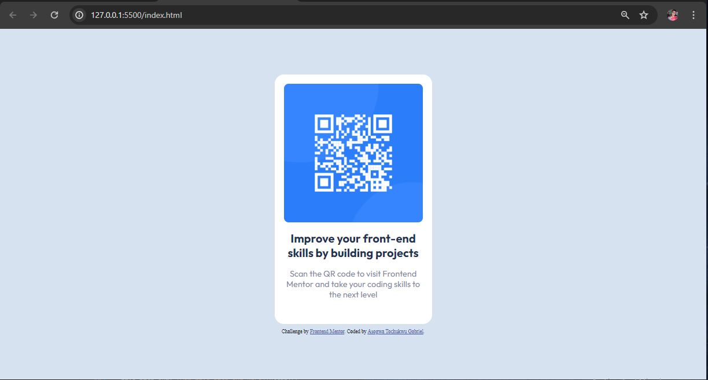

# Frontend Mentor - QR code component solution

This is a solution to the [QR code component challenge on Frontend Mentor](https://www.frontendmentor.io/challenges/qr-code-component-iux_sIO_H). Frontend Mentor challenges help you improve your coding skills by building realistic projects. 

## Table of contents

- [Overview](#overview)
  - [Screenshot](#screenshot)
  - [Built with](#built-with)
  - [What I learned](#what-i-learned)
  - [Continued development](#continued-development)
- [Author](#author)

## Overview
QR code component project is focused on the use of Html and css for both structing and stying a QR code on a webpage using a ui/ux design of the given page

### Screenshot

### Built with

- HTML
- CSS

### What I learned
- pushing a file from vscode to github
- centering a div
- making a website responsive

### Continued development
- learning react 
- interactive webpage/webapp
- creating a webapp

## Author

Name: Asogwa Tochukwu Gabriel
- Frontend Mentor - [@Tochukwu-1](https://www.frontendmentor.io/profile/Tochukwu-1)
- Twitter - [@A__Gabriel__T](https://x.com/A__Gabriel__T?t=ZY800ZJW5PjCnGwOrVLtoA&s=09)

